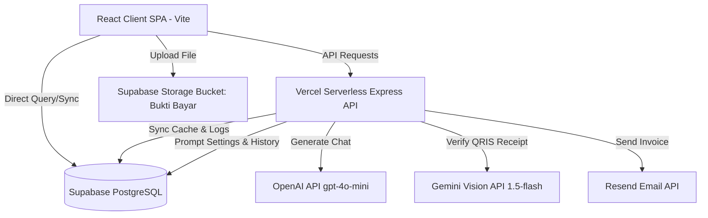
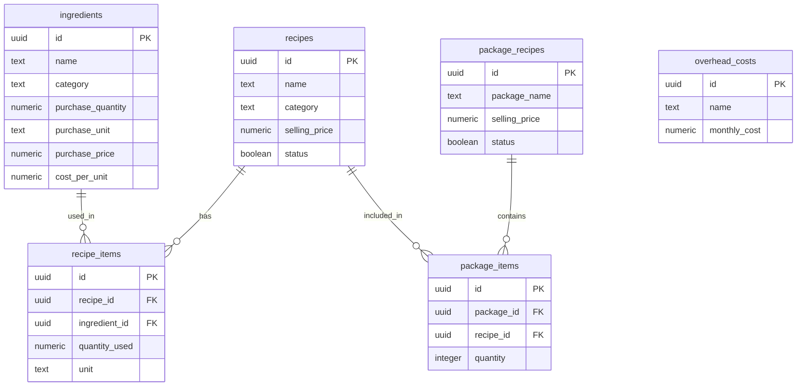

# LAPORAN AUDIT TEKNIS DAN BISNIS LENGKAP: WEBSITE TAMPA SEDUH
*Tanggal Audit: 22 Juni 2026*  
*Terakhir Diperbarui: 26 Juni 2026*  
*Auditor: Antigravity AI Coding Assistant*  
*Bahasa Dokumen: Bahasa Indonesia*  

---

## BAGIAN 1 - RINGKASAN PROYEK

### Nama Project
Project ini bernama **Tampa Seduh**, sebuah platform e-commerce dan sistem manajemen operasional kedai kopi artisanal (*Street Coffee Nomor 1*) yang berlokasi di Kotabunan, Bolaang Mongondow Timur (Boltim), Sulawesi Utara.

### Framework dan Teknologi Utama
Sistem ini dibangun menggunakan arsitektur modern berbasis TypeScript dengan rincian *stack* sebagai berikut:
1. **Frontend**: React.js (Vite) dengan TypeScript. Desain antarmuka (UI/UX) dikembangkan menggunakan TailwindCSS untuk penataan gaya visual, `lucide-react` untuk sistem ikonografi, dan `framer-motion` untuk pengelolaan animasi transisi mikro yang halus.
2. **Backend**: Express.js (Node.js) yang dideploy secara *Serverless* di infrastruktur **Vercel Serverless Functions**.
3. **Database**: **Supabase** (PostgreSQL) yang mendukung penyimpanan relasional, autentikasi pengguna, penyimpanan file (*Storage*), serta fitur *real-time subscription*.
4. **Enjin AI**: OpenAI API (`gpt-4o-mini`) untuk asisten percakapan interaktif "Tanya Emat" dan Google Generative AI (`gemini-1.5-flash`) untuk sistem verifikasi otomatis bukti transfer QRIS.

---

### Arsitektur Aplikasi
Aplikasi ini menggunakan **Arsitektur Hybrid (Client-Server-Database)** yang dioptimasi untuk platform serverless:



Untuk mengatasi keterbatasan *cold start* dan batas memori di Vercel Serverless, backend Express menerapkan konsep **In-Memory Caching dengan Sinkronisasi Non-Blocking ke Supabase**:
* Saat server menerima *request* pertama (*cold start*), middleware backend memicu fungsi `syncFromSupabase()` untuk menarik seluruh data master (menu, paket, orders, users, blog, logs) secara paralel ke dalam variabel memori server.
* Setiap operasi penulisan data (seperti `POST /api/menu`, `POST /api/orders`) akan langsung memutakhirkan cache di memori server untuk respon cepat, lalu meluncurkan fungsi asinkron `writeSupabase()` di latar belakang guna menulis data tersebut ke Supabase PostgreSQL tanpa memblokir respon HTTP pengguna.

---

### Struktur Frontend
Frontend dirancang sebagai Single Page Application (SPA) berbasis komponen modular. Komponen-komponen berat (seperti halaman Checkout, User Dashboard, Admin Dashboard, AI Chat Widget, dan Modul Costing) dimuat secara asinkron menggunakan teknik *Code Splitting* (`React.lazy()`) dan dibungkus dalam komponen `<Suspense>` untuk mereduksi ukuran bundel awal (*Initial Bundle Size*) sehingga meminimalkan waktu pemuatan halaman pertama.

### Struktur Backend
Seluruh API backend berada di dalam file [server.ts](file:///Users/bayu_1/Documents/WEBSITE%20BUILDER/Tampa%20Seduh/Tampa-Seduh/server.ts) yang diekspor sebagai modul Express. File [api/index.ts](file:///Users/bayu_1/Documents/WEBSITE%20BUILDER/Tampa%20Seduh/Tampa-Seduh/api/index.ts) bertindak sebagai *endpoint wrapper* serverless bagi Vercel, mengarahkan setiap *path* `/api/*` ke instansi Express tersebut.

### Struktur Database
Database di-host di Supabase PostgreSQL dengan konfigurasi Row Level Security (RLS) diaktifkan pada semua tabel utama. Karena server backend Vercel berkomunikasi menggunakan *Client Anonymous Key* (koneksi anonim publik), kebijakan keamanan PostgreSQL (RLS) diatur secara longgar agar publik (`anon` role) dapat melakukan operasi `SELECT`, `INSERT`, `UPDATE`, dan `DELETE` pada tabel-tabel operasional seperti `menu`, `packages`, `orders`, dan `users`.

---

### Integrasi Pihak Ketiga
1. **Supabase Client SDK**: Autentikasi pengguna, sinkronisasi tabel, dan manajemen media di bucket penyimpanan.
2. **OpenAI SDK (`gpt-4o-mini`)**: Digunakan untuk menghasilkan respon asisten digital "Tanya Emat" berdasarkan basis pengetahuan produk yang dinamis.
3. **Google Generative AI SDK (`gemini-1.5-flash`)**: Membaca data gambar bukti transfer yang diunggah pengguna ke bucket Supabase, memverifikasi kesesuaian nominal tagihan, dan mengubah status pesanan secara otomatis menjadi *Completed*.
4. **Resend SDK**: Mengirimkan email konfirmasi pesanan terformat HTML secara otomatis kepada pengguna.
5. **Formspree**: Meneruskan salinan rangkuman pemesanan ke kotak masuk email tim admin Tampa Seduh sebagai cadangan darurat.

---

### Status Pengembangan Saat Ini
Aplikasi saat ini berada pada fase **LIVE PRODUCTION**. Seluruh fitur utama e-commerce, manajemen admin, takeover obrolan pelanggan, pengiriman email otomatis (invoice + welcome + admin notifikasi), verifikasi transfer AI, serta Modul **Costing & Recipe Lab (HPP)** dan **Real Profit Engine V1** telah berhasil diimplementasikan. Build produksi TypeScript lulus tanpa error (`npm run build` sukses).

#### Fitur yang Sudah Selesai:
1. **Storefront Interaktif**: Menampilkan daftar menu kopi reguler/besar (panas/dingin/snack) dan paket promo dengan efek visual modern.
2. **Floating Cart**: Keranjang belanja melayang dengan animasi interaktif berbasis Framer Motion.
3. **Autentikasi Ganda**: Pendaftaran/masuk akun menggunakan Email/Password secara lokal, serta integrasi Google OAuth melalui Supabase.
4. **Checkout Terpadu**: Pilihan pengiriman COD di area Kotabunan/Tutuyan/Panang/Paret atau ambil sendiri (*Pickup*).
5. **Diskon Ongkir Member**: Pemotongan otomatis ongkos kirim sebesar 25% bagi pelanggan yang akun keanggotaannya disetujui admin.
6. **User Dashboard**: Memungkinkan pelanggan mengubah profil, password, melihat histori transaksi, serta mencetak dokumen invoice.
7. **Admin Dashboard (15 Modul Aktif)**: Termasuk pengelolaan menu, paket, visualisasi keuangan real (format Rupiah standar), CMS berita, kontrol status pengguna (block/unblock), manajemen log email, chat takeover, pengaturan prompt AI, dan Sign Control (Buka/Tutup Kedai).
8. **Modul Costing & Recipe Lab (HPP)**: Sistem pelacakan bahan baku, penghitungan HPP resep menu, HPP paket, lab analitis margin profit, dan biaya operasional overhead bulanan.
9. **Halaman Invoice Publik (`/invoice/:orderId`)**: Pelanggan menerima link invoice via email, dapat melihat live status 4 tahap, dan download PDF.
10. **Real Profit Engine V1**: Kalkulasi HPP & gross profit aktual otomatis saat status order berubah menjadi *Completed*, tersimpan di tabel `order_profit`.
11. **Sistem Email Otomatis (Resend API)**: Welcome email (registrasi), invoice email (order masuk), admin notifikasi (setiap order baru).
12. **Tiga Sifat Penyajian Menu**: Dingin ❄️, Panas ☕, dan Snack 🍪 — muncul sebagai section terpisah di storefront.
13. **Sign Buka/Tutup Kedai**: Tanda vintage analog di homepage (antara Hero & Menu section) yang terhubung langsung ke backend. Admin mengontrol status dari Admin Panel → Overview. Tutup kedai = kedai fisik tutup, delivery 24/7 tetap aktif.
14. **Konfirmasi Dialog Admin**: Sebelum toggle status kedai, dialog konfirmasi inline ditampilkan — mencegah perubahan tidak sengaja.
15. **iOS Safari Layout Stability**: Horizontal scroll lock, rubber-band bounce prevention, touch-action pan-y, tap highlight removal — mencegah layout geser di iPhone.
16. **LCP Optimasi**: `<link rel="preload" as="image" fetchpriority="high">` untuk Hero.jpeg — browser langsung memuat gambar hero saat parse HTML, sebelum JS bundle diunduh.
17. **Pemisahan Kategori Snack & Minuman**: Menu makanan ringan (Snack/Roti) dipisahkan sepenuhnya dari menu minuman di storefront, memberikan visualisasi menu yang terstruktur dan mempermudah pemesanan.
18. **Kelola Instruksi Tambahan AI Master**: Fitur interaktif di panel Admin Dashboard -> AI Master untuk menambah dan menghapus instruksi/aturan tambahan secara dinamis, tersimpan di database Supabase (tabel `ai_settings` dengan `key = 'admin_instructions'`).
19. **Metode Checkout Opsional Tanpa WhatsApp/Email**: Pelanggan dapat checkout tanpa harus mengisi nomor WhatsApp atau email. Validasi diubah agar menerima isian opsional, dan secara otomatis mengisi tanda hubung `"-"` di database agar tidak melanggar aturan integritas database.
20. **No Skip Order pada Penolakan Bukti Pembayaran AI**: Menjamin bahwa pesanan tidak akan terhapus atau terlewat saat AI mendeteksi bukti bayar palsu. Pesanan disimpan sebagai `pending` dengan penandaan catatan, dan Admin dapat meninjau serta menghapusnya secara manual di dashboard. Banner peringatan keras juga dipasang di UI checkout.
21. **Robustness Hardening Akun Tamu**: Sistem secara otomatis menggenerasi alamat email acak unik (`[nama]-[random]@guest.tampaseduh.com`) untuk pemesan tamu guna mencegah kegagalan constraint UNIQUE database pada Supabase jika memesan berulang kali.
22. **Tombol Unduh Aplikasi Android (Tilted Style)**: Tombol unduh aplikasi Android ("Download App") yang estetik dan sedikit miring (+2.5 derajat) diletakkan di samping sign "24/7 Delivery" pada section Hero halaman depan, mengarah langsung ke link unduh Google Drive APK Tampa Seduh.

#### Fitur yang Belum Selesai / Placeholder:
1. **Sistem POS (Point of Sales) Cabang**: Pengoperasian kasir kas offline langsung di kedai fisik belum terintegrasi (transaksi saat ini 100% diasumsikan masuk via checkout website).
2. **Dynamic Inventory Deduction**: Pengurangan stok bahan baku secara otomatis di tabel `ingredients` sesaat setelah order diselesaikan (*Completed*) belum aktif di tingkat database (HPP resep saat ini murni bersifat analitis).
3. **Multi-Cabang Fisik**: Data menu dan transaksi masih terpusat di satu cabang database utama. Pilihan cabang belum tersedia di halaman depan toko.
4. **Visualisasi Grafik Keuangan (Recharts)**: Panel keuangan masih menggunakan tabel dan hitungan, belum menggunakan library grafik interaktif.

---

## BAGIAN 2 - STRUKTUR FOLDER

Berikut adalah peta struktur folder dan file lengkap proyek Tampa Seduh:

```
Tampa-Seduh/
├── .env                  # Variabel lingkungan lokal berisi kunci rahasia API (diabaikan Git)
├── .env.example          # Template konfigurasi variabel lingkungan untuk kolaborasi
├── .gitignore            # Konfigurasi pengecualian pelacakan file Git
├── index.html            # File HTML utama sebagai kerangka dasar aplikasi (entri SEO)
├── package.json          # File konfigurasi dependensi npm dan skrip otomasi proyek
├── tsconfig.json         # Konfigurasi transpiler TypeScript compiler
├── vercel.json           # Aturan perutean url dan konfigurasi deployment Vercel Serverless
├── vite.config.ts        # Konfigurasi bundler build Vite dan integrasi plugin React
├── wrangler.toml         # Konfigurasi pendukung (opsional) Cloudflare Wrangler
├── server.ts             # Kode utama backend server Express.js full-stack
├── deployment_guide.md   # Panduan teknis deployment serverless ke Vercel
├── Laporan_Website_Tampa_Seduh.md   # Dokumen audit teknis dan bisnis ini
├── Security_Hardening_Audit_Report.md # Laporan audit keamanan Phase 1 + 2B update
├── schema.sql            # DDL inisialisasi database dan seed data awal
├── rls.sql               # Konfigurasi Row Level Security dasar
├── storage_rls.sql       # RLS bucket penyimpanan Bukti Bayar
├── fix_menu_rls.sql      # Fix RLS tabel menu & packages untuk backend
├── fix_supabase_security.sql # Fix RLS audit_logs, email_logs, orders
├── schema_migration.sql  # Migrasi: membership_status, chat_sessions, chat_messages
├── add_is_blocked.sql    # Migrasi: kolom is_blocked di tabel users
├── recipe_lab_migration.sql # Tabel ingredients, recipes, recipe_items, overhead_costs
├── security_hardening_rls.sql # Trigger keamanan (SKIP — tidak diapply)
├── migration_menu_category.sql # Migrasi: kolom menu_category (hot/cold/snack)
│
├── scratch/
│   └── create_order_profit_table.sql # Tabel order_profit untuk Real Profit Engine V1
│
├── api/                  # Entri backend untuk Vercel Serverless Function
│   └── index.ts          # Mengimpor Express app dari server.ts dan mengekspornya ke Vercel
│
├── public/               # Direktori aset statis publik bebas kompilasi
│   ├── FaviconTampaSeduh.webp # Favicon ikon tab browser teroptimasi
│   ├── Logo.jpeg / Logo Tampa Seduh.png # Aset logo resmi kedai
│   ├── qris_tampa_seduh.png   # QRIS pembayaran statis kedai
│   ├── _redirects        # Konfigurasi fallback routing untuk deployment server statis
│   └── Produk/           # Folder penyimpanan gambar menu awal bawaan kedai
│
├── src/                  # Direktori utama kode sumber aplikasi React
│   ├── main.tsx          # Entri utama eksekusi modul JavaScript React
│   ├── App.tsx           # Struktur layout utama, router, status global, dan landing page
│   ├── index.css         # Konfigurasi CSS global dan integrasi utilitas TailwindCSS
│   ├── types.ts          # Deklarasi tipe data dan interface TypeScript global
│   │
│   ├── lib/              # Modul klien penghubung API dan database
│   │   ├── api.ts        # Klien pemanggil REST API backend Express (/api/*)
│   │   ├── supabase.ts   # Inisialisasi klien Supabase JS SDK
│   │   └── recipeLabApi.ts # Modul komunikasi API database untuk Costing/HPP
│   │
│   └── components/       # Kumpulan komponen UI modular
│       ├── AdminDashboard.tsx   # Panel kontrol administrator utama
│       ├── AdminRecipeLab.tsx   # Panel manajemen costing bahan baku & analisis HPP
│       ├── AiChatWidget.tsx     # Widget obrolan mengambang pelanggan ("Tanya Emat")
│       ├── CheckoutPage.tsx     # Halaman formulir pemesanan dan unggah bukti bayar
│       ├── CoffeeNews.tsx       # Modul pembaca berita dan artikel blog kopi
│       ├── GlobalNotification.tsx # Komponen notifikasi mengambang real-time
│       ├── InvoicePage.tsx      # Halaman invoice publik dengan live status tracker (BARU)
│       ├── OrderPopup.tsx       # Dialog konfirmasi pesanan masuk (admin)
│       └── UserDashboard.tsx    # Portal personal pelanggan (history & invoice)
```

---

## BAGIAN 3 - DATABASE SUPABASE

Database Tampa Seduh menggunakan PostgreSQL yang dikelola melalui platform Supabase. RLS (*Row Level Security*) diaktifkan di seluruh tabel utama. Per 23 Juni 2026 total terdapat **18 tabel aktif** yang menyusun sistem database Tampa Seduh:

### 1. Tabel-Tabel Operasional E-Commerce & Log

| Nama Tabel | Tujuan Tabel | Jumlah Kolom | Nama Kolom & Tipe Data | Primary Key | Foreign Key | Index | RLS Policy | Trigger / Function |
| :--- | :--- | :--- | :--- | :--- | :--- | :--- | :--- | :--- |
| **`menu`** | Menyimpan daftar produk minuman kopi dan makanan pendamping. | 8 | `id` (TEXT), `name` (TEXT), `price_reg` (INT), `price_large` (INT), `is_hot` (BOOL), `is_available` (BOOL), `image` (TEXT), `description` (TEXT) | `id` | Tidak Ada | PK Index on `id` | **Public read/write**: `anon` diizinkan melakukan select, insert, update, dan delete. | Tidak Ada |
| **`packages`** | Menyimpan data paket promo bundling kopi dan roti. | 7 | `id` (TEXT), `name` (TEXT), `price` (INT), `items` (JSONB), `description` (TEXT), `badge` (TEXT), `image` (TEXT) | `id` | Tidak Ada | PK Index on `id` | **Public read/write**: `anon` diizinkan melakukan select, insert, update, dan delete. | Tidak Ada |
| **`orders`** | Menyimpan riwayat transaksi pemesanan produk pelanggan. | 15 | `id` (TEXT), `customer_name` (TEXT), `whatsapp` (TEXT), `email` (TEXT), `address` (TEXT), `items` (JSONB), `total` (INT), `status` (TEXT), `created_at` (TIMESTAMPTZ), `delivery_method` (TEXT), `subtotal` (INT), `shipping_cost` (INT), `shipping_discount` (INT), `notes` (TEXT), `payment_proof_url` (TEXT) | `id` | Tidak Ada | PK Index on `id` | **Public read/write**: `anon` diizinkan select, insert, dan update status. | Tidak Ada |
| **`users`** | Menyimpan kredensial pengguna, profil, role, status blokir, dan membership. | 11 | `id` (TEXT), `name` (TEXT), `email` (TEXT), `password` (TEXT), `role` (TEXT), `is_member` (BOOL), `orders_count` (INT), `last_active` (TEXT), `is_blocked` (BOOL), `membership_status` (TEXT), `whatsapp` (TEXT), `address` (TEXT), `avatar_url` (TEXT) | `id` | Tidak Ada | PK Index on `id`, UNIQUE index on `email` | **Public read/write**: Diperlukan untuk registrasi, login, Google Sync, dan update profil mandiri. | Tidak Ada |
| **`audit_logs`** | Mencatat riwayat operasional admin demi akuntabilitas sistem. | 4 | `id` (TEXT), `action` (TEXT), `details` (TEXT), `timestamp` (TIMESTAMPTZ) | `id` | Tidak Ada | PK Index on `id` | **Public select/insert**: Anon dapat membaca dan menyisipkan log audit dari server. | Tidak Ada |
| **`blog_news`** | Menyimpan artikel CMS berita promo atau cerita seputar kopi. | 8 | `id` (TEXT), `title` (TEXT), `slug` (TEXT), `content` (TEXT), `author` (TEXT), `date` (TEXT), `cover_image` (TEXT), `category` (TEXT) | `id` | Tidak Ada | PK Index on `id`, UNIQUE index on `slug` | **Public Read-Only**: Anon hanya dapat membaca konten. Modifikasi data via dashboard menggunakan anon key. | Tidak Ada |
| **`email_logs`** | Log riwayat pengiriman invoice digital via Resend API. | 6 | `id` (TEXT), `recipient` (TEXT), `subject` (TEXT), `status` (TEXT), `timestamp` (TIMESTAMPTZ), `body` (TEXT) | `id` | Tidak Ada | PK Index on `id` | **Public select/insert**: Serverless Vercel dapat menyisipkan log email. | Tidak Ada |
| **`ai_settings`** | Menyimpan instruksi utama karakter AI Emat (System Prompt). | 3 | `key` (TEXT), `system_prompt` (TEXT), `temperature` (DOUBLE PRECISION) | `key` | Tidak Ada | PK Index on `key` | **Public select/upsert**: Siapa pun dapat membaca konfigurasi AI secara default. | Tidak Ada |

---

### 2. Tabel-Tabel Modul Costing & Recipe Lab (HPP)

| Nama Tabel | Tujuan Tabel | Jumlah Kolom | Nama Kolom & Tipe Data | Primary Key | Foreign Key | Index | RLS Policy | Trigger / Function |
| :--- | :--- | :--- | :--- | :--- | :--- | :--- | :--- | :--- |
| **`ingredients`** | Inventarisasi data bahan baku mentah dan harga beli. | 10 | `id` (UUID), `name` (TEXT), `category` (TEXT), `purchase_quantity` (NUMERIC), `purchase_unit` (TEXT), `purchase_price` (NUMERIC), `cost_per_unit` (NUMERIC), `supplier` (TEXT), `created_at` (TIMESTAMPTZ), `updated_at` (TIMESTAMPTZ) | `id` | Tidak Ada | PK Index on `id` | **Public read / Admin write**: Diaktifkan di SQL dengan akses select terbuka. | Kolom `cost_per_unit` adalah **Stored Generated Column** (`purchase_price / purchase_quantity`). |
| **`recipes`** | Formulir data produk tunggal resep menu. | 9 | `id` (UUID), `name` (TEXT), `category` (TEXT), `description` (TEXT), `selling_price` (NUMERIC), `status` (BOOL), `created_at` (TIMESTAMPTZ), `updated_at` (TIMESTAMPTZ) | `id` | Tidak Ada | PK Index on `id` | **Public read / Admin write**: Semua user dapat membaca data resep. | Tidak Ada |
| **`recipe_items`** | Penghubung takaran bahan baku yang digunakan dalam resep. | 6 | `id` (UUID), `recipe_id` (UUID), `ingredient_id` (UUID), `quantity_used` (NUMERIC), `unit` (TEXT), `created_at` (TIMESTAMPTZ) | `id` | `recipe_id` -> `recipes(id)` ON DELETE CASCADE, `ingredient_id` -> `ingredients(id)` ON DELETE RESTRICT | PK Index, FK Indexes | **Public read / Admin write**: Mengamankan relasi resep bahan baku. | Tidak Ada |
| **`package_recipes`**| Menu data komposit resep untuk paket bundling. | 5 | `id` (UUID), `package_name` (TEXT), `selling_price` (NUMERIC), `status` (BOOL), `created_at` (TIMESTAMPTZ) | `id` | Tidak Ada | PK Index | **Public read / Admin write** | Tidak Ada |
| **`package_items`** | Menggabungkan resep-resep ke dalam paket bundling resep. | 4 | `id` (UUID), `package_id` (UUID), `recipe_id` (UUID), `quantity` (INT) | `id` | `package_id` -> `package_recipes(id)` ON DELETE CASCADE, `recipe_id` -> `recipes(id)` ON DELETE RESTRICT | PK Index, FK Indexes | **Public read / Admin write** | Tidak Ada |
| **`overhead_costs`**| Menyimpan komponen biaya pengeluaran operasional bulanan. | 4 | `id` (UUID), `name` (TEXT), `monthly_cost` (NUMERIC), `created_at` (TIMESTAMPTZ) | `id` | Tidak Ada | PK Index | **Public read / Admin write** | Tidak Ada |

---

### 3. Tabel-Tabel Sistem Percakapan Live Chat (Takeover)

| Nama Tabel | Tujuan Tabel | Jumlah Kolom | Nama Kolom & Tipe Data | Primary Key | Foreign Key | Index | RLS Policy | Trigger / Function |
| :--- | :--- | :--- | :--- | :--- | :--- | :--- | :--- | :--- |
| **`chat_sessions`** | Menyimpan sesi obrolan aktif pelanggan dan status takeover. | 5 | `id` (TEXT), `user_name` (TEXT), `is_sabotaged` (BOOL), `last_active` (TIMESTAMPTZ), `created_at` (TIMESTAMPTZ) | `id` | Tidak Ada | PK Index on `id` | **Public read/write**: Diperlukan agar klien dapat membaca status sabotase dan mengupdate keaktifan. | Tidak Ada |
| **`chat_messages`** | Menyimpan baris pesan percakapan chat. | 5 | `id` (UUID), `session_id` (TEXT), `sender` (TEXT), `text` (TEXT), `timestamp` (TIMESTAMPTZ) | `id` | `session_id` -> `chat_sessions(id)` ON DELETE CASCADE | PK Index, Index on `session_id` | **Public read/write**: Diperlukan agar client dan admin dapat menyisipkan dan membaca chat. | Tidak Ada |

---

## BAGIAN 4 - AUTENTIKASI

Sistem autentikasi di website Tampa Seduh dikembangkan dengan pendekatan **Dual-Channel Authentication (Lokal Email & Google OAuth)** yang dikelola langsung oleh Supabase Auth dan disinkronkan ke Express Backend:

### 1. Login Manual (Email & Password)
* **Pendaftaran (Register)**:
  * Pengguna memasukkan `name`, `email`, `password`, dan `whatsapp`.
  * Client melakukan `POST /api/auth/register`. Server memeriksa keunikan email di cache memori.
  * Jika email belum digunakan, data pengguna disisipkan ke cache lokal dan ditulis secara asinkron ke tabel `users` di Supabase. Password disimpan dalam bentuk *plain-text* di database (Menjadi temuan audit keamanan).
* **Masuk (Login)**:
  * Pengguna mengirimkan email dan password via `POST /api/auth/login`.
  * Server memeriksa apakah email cocok dengan kredensial Administrator yang dideklarasikan di variabel lingkungan (`ADMIN_EMAIL` & `ADMIN_PASSWORD`). Jika cocok, pengguna langsung diberi peranan `admin`.
  * Jika bukan admin, server mencocokkan email dan password pada daftar pengguna terdaftar. Jika valid, kredensial pengguna dikembalikan dengan peranan `customer`.

### 2. Login via Google (OAuth 2.0)
* Di sisi frontend, tombol masuk Google memanggil fungsi Supabase SDK:
  ```typescript
  supabase.auth.signInWithOAuth({
    provider: "google",
    options: { redirectTo: `${window.location.origin}/auth/callback` }
  });
  ```
* Setelah verifikasi Google berhasil, Supabase mengarahkan kembali pengguna ke website Tampa Seduh.
* Komponen `App.tsx` menangkap perubahan status autentikasi melalui trigger listener `supabase.auth.onAuthStateChange`.
* Callback ini secara otomatis memanggil fungsi `syncSupabaseSession(session)`:
  1. Melakukan pemeriksaan langsung ke tabel `users` di database Supabase berdasarkan UUID Supabase atau alamat email Google.
  2. Jika profil pengguna belum ada, sistem secara otomatis melakukan `INSERT` data profil baru dengan `role: 'customer'`, `orders_count: 0`, dan `is_member: false`.
  3. Mengirimkan salinan profil pengguna ke Express Backend memori via `POST /api/users/sync` untuk memastikan cache memori backend sinkron.
  4. Menyimpan sesi login di memori aplikasi React (`currentUser` state).

### 3. Session Management
Sesi pengguna dikelola secara independen di sisi klien oleh Supabase Client Library dengan memanfaatkan penyimpanan browser (*LocalStorage*). Token akses secara otomatis disematkan dalam header *request* Supabase. Di sisi backend Express, sinkronisasi memori memastikan status pengguna tetap aktif meskipun serverless Vercel mengalami *Cold Start*.

### 4. Peranan Pengguna (Roles & Permissions)
Sistem membedakan dua tingkat otorisasi pengguna:
1. **Role Admin**:
   * Diperoleh jika login menggunakan email admin (`kopi@tampaseduh.com` atau `tampaseduh@gmail.com`) atau memiliki nilai `role = 'admin'` di tabel database `users`.
   * Memiliki akses penuh ke panel administrator, dapat mengubah status pesanan, memodifikasi menu/paket, menyetujui member, melihat statistik keuangan, meretas obrolan AI (takeover), mengubah System Prompt AI, dan mengelola resep HPP.
2. **Role Customer**:
   * Peranan bawaan untuk seluruh pendaftaran baru dan Google OAuth login.
   * Hanya diizinkan mengakses storefront, checkout pesanan, dan User Dashboard pribadi mereka.

### 5. Middleware & Route Protection
Aplikasi ini **tidak memiliki middleware otentikasi berbasis token JWT di sisi server**. Seluruh proteksi rute halaman diselesaikan di tingkat klien (*Client-side Routing Protection*) di dalam file `App.tsx` dan komponen dashboard. Rute diproteksi secara kondisional menggunakan percabangan state di React (misal: `isAdminMode` dan `showUserDashboard`). 

---

## BAGIAN 5 - USER DASHBOARD

User Dashboard adalah portal personal bagi pelanggan yang terdaftar untuk mengelola profil dan melacak transaksi. Berikut rincian fiturnya:

### 1. Aktivasi Member Gratis & Diskon Ongkir
* **Fungsi**: Pelanggan dapat mengajukan aktivasi keanggotaan member secara gratis. Keanggotaan ini memberi keuntungan berupa **Diskon Ongkos Kirim 25%** untuk setiap pemesanan dengan metode pengantaran (*Delivery*).
* **Halaman**: Tab Kiri Atas Dashboard (Menampilkan "VIP Member Card" Shimmer Emas jika disetujui, atau tombol "Gabung Member" jika belum aktif).
* **Database**: Tabel `users`, kolom `membership_status` (diset ke `pending` saat mendaftar, lalu diset `approved` dan `is_member = true` setelah disetujui admin).
* **API Terkait**: `POST /api/auth/subscribe` (mengubah status ke `pending`).

### 2. Riwayat Pesanan (Order History)
* **Fungsi**: Menampilkan daftar semua transaksi yang pernah dilakukan oleh pengguna. Menampilkan status terkini pesanan secara real-time: `Menunggu` (Pending), `Disiapkan` (Preparing), `Diantar` (Delivering), atau `Selesai` (Completed).
* **Halaman**: Kolom Kanan Utama Dashboard.
* **Database**: Tabel `orders` (difilter berdasarkan alamat email pengguna).
* **API Terkait**: `GET /api/orders?email={user_email}`.

### 3. Cetak & Unduh Invoice Tagihan
* **Fungsi**: Tombol di setiap item transaksi untuk membuka jendela cetak browser baru dan menyajikan dokumen invoice tagihan terformat rapi (mencantumkan rincian item, subtotal, ongkir, diskon member, total bayar, metode delivery, dan status pembayaran "PAID/UNPAID").
* **Halaman**: Pop-up cetak dipicu langsung dari item riwayat pesanan.
* **Database**: Tabel `orders`.
* **API Terkait**: Penanganan data sepenuhnya diproses di sisi frontend klien setelah data riwayat terunduh.

### 4. Edit Profil & Pemutakhiran Password
* **Fungsi**: Formulir bagi pengguna untuk melengkapi data nama lengkap, nomor WhatsApp aktif, alamat pengantaran default (sehingga tidak perlu mengisi alamat berulang kali saat checkout), serta mengubah kata sandi lama dengan kata sandi baru.
* **Halaman**: Box profil di sebelah kiri bawah dashboard.
* **Database**: Tabel `users`.
* **API Terkait**: `POST /api/users/update` (mengupdate profil), `PUT /api/users/:id/password` (mengupdate password).

### 5. Tombol Pintas Bantuan Kurir
* **Fungsi**: Tombol Call-To-Action (CTA) berlogo WhatsApp yang mengarahkan pengguna langsung ke obrolan kurir/admin Tampa Seduh dengan pesan otomatis berisi detail Order ID jika pengguna membutuhkan bantuan darurat atas pesanannya.
* **Halaman**: Bagian bawah sidebar dashboard.

---

## BAGIAN 6 - ADMIN DASHBOARD

Admin Dashboard Tampa Seduh adalah pusat kendali bisnis kedai kopi. Berikut adalah analisis mendalam terhadap ke-13 modul yang ada:

### 1. Overview
* **Fungsi**: Menyajikan visualisasi matriks bisnis utama (Total Transaksi, Total Pendapatan Kotor dalam Rupiah, Jumlah Pengguna Baru Terdaftar, Jumlah Member Aktif). Menampilkan juga grafik garis aktivitas pemesanan harian serta ringkasan daftar 5 pesanan teratas yang masuk.
* **Database**: `orders` dan `users`.
* **API Terkait**: `GET /api/orders`, `GET /api/users`.
* **Status Implementasi**: 100% Selesai dan berfungsi dengan penarikan data dinamis.
* **Kekurangan**: Grafik perkembangan masih berbasis visualisasi div CSS statis sederhana, belum menggunakan library chart interaktif seperti Chart.js atau Recharts.

### 2. Order
* **Fungsi**: Daftar pesanan langsung (*Live Order Queue*). Admin dapat mengubah status pesanan secara *real-time* (`pending` $\rightarrow$ `preparing` $\rightarrow$ `delivering` $\rightarrow$ `completed`). Tersedia tombol untuk memicu analisis validitas gambar bukti transfer secara otomatis menggunakan AI Vision.
* **Database**: `orders`, `audit_logs`.
* **API Terkait**: `GET /api/orders`, `PUT /api/orders/:id/status`, `POST /api/orders/:id/verify-payment` (Verifikasi Gemini AI).
* **Status Implementasi**: 100% Berfungsi.
* **Kekurangan**: Tidak ada notifikasi suara (seperti bunyi bel/klakson) saat ada pesanan baru masuk ke antrean admin, memaksa admin harus memantau layar secara manual.

### 3. Invoice & Bukti
* **Fungsi**: Memungkinkan admin memeriksa bukti pembayaran transfer bank/e-wallet yang diunggah oleh pelanggan. Admin juga dapat memicu pencetakan invoice transaksi langsung dari tab ini.
* **Database**: `orders`.
* **API Terkait**: Penayangan gambar langsung terhubung ke CDN bucket `Bukti Bayar` di Supabase Storage.
* **Status Implementasi**: Selesai.
* **Kekurangan**: Bukti gambar dimuat apa adanya tanpa fitur rotasi atau zoom, menyulitkan pemeriksaan jika pelanggan mengunggah foto struk secara menyamping/miring.

### 4. Daftar Menu
* **Fungsi**: Modul manajemen produk kopi dan roti. Admin dapat menambah produk baru, mengedit nama, harga regular/large, status ketersediaan (*kosong/tersedia*), deskripsi produk, jenis minuman (*panas/dingin*), dan mengunggah gambar produk.
* **Database**: `menu`, `audit_logs`.
* **API Terkait**: `GET /api/menu`, `POST /api/menu`, `PUT /api/menu/:id`, `DELETE /api/menu/:id`, `POST /api/upload`.
* **Status Implementasi**: 100% Selesai dan berfungsi.
* **Kekurangan**: Gambar menu yang diunggah dikonversi langsung menjadi Base64 di memori browser sebelum dikirim ke API, berisiko mengalami *browser crash* jika gambar berukuran sangat besar (di atas 10MB).

### 5. Daftar Paket
* **Fungsi**: Mengelola paket promo hemat (misal: Paket Nongkrong Ramean). Admin menentukan harga paket, diskon, deskripsi, lambang lencana (*badge*), gambar promosi, dan memilih menu kopi apa saja yang dimasukkan ke dalam paket bundling tersebut.
* **Database**: `packages`.
* **API Terkait**: `GET /api/packages`, `POST /api/packages`, `PUT /api/packages/:id`, `DELETE /api/packages/:id`.
* **Status Implementasi**: Selesai.
* **Kekurangan**: Validasi data tidak membatasi admin untuk memasukkan ID menu yang sudah dihapus ke dalam paket, berpotensi menimbulkan eror di sisi pengguna jika menu di dalam paket tidak valid.

### 6. Keuangan
* **Fungsi**: Menyajikan laporan neraca keuangan dinamis. Mengagregasikan pendapatan kotor dari pesanan yang sukses (`completed`) dan menghitung estimasi keuntungan bersih dengan memotong perkiraan biaya operasional modal (default diset 45%).
* **Database**: `orders`.
* **API Terkait**: `GET /api/finances`.
* **Status Implementasi**: Berfungsi.
* **Kekurangan**: Formula pemotongan modal bersih masih statis menggunakan asumsi pengali 45% (belum tersambung ke biaya bahan baku nyata dari modul Recipe Lab).

### 7. Kopi News (CMS Blog)
* **Fungsi**: Content Management System (CMS) mini untuk mempublikasikan artikel edukatif seputar kopi Liberica Kotabunan atau pengumuman promo kedai di halaman depan toko.
* **Database**: `blog_news`.
* **API Terkait**: `GET /api/news`, `POST /api/news`.
* **Status Implementasi**: Selesai.
* **Kekurangan**: Pengeditan blog pasca-publikasi belum didukung. Jika ada kesalahan ketik, admin harus menghapus tulisan secara manual di database Supabase dan memposting ulang.

### 8. Pengguna
* **Fungsi**: Menampilkan database pelanggan terdaftar. Admin dapat menyetujui status langganan member (`Approve Membership`), atau memblokir pengguna jahat (`Block User`) agar mereka tidak bisa melakukan checkout di website.
* **Database**: `users`, `audit_logs`.
* **API Terkait**: `GET /api/users`, `PUT /api/users/:id/approve-membership`, `PUT /api/users/:id/block`.
* **Status Implementasi**: Selesai.
* **Kekurangan**: Tidak ada fitur pencarian (*Search*) nama/email pengguna, menyulitkan pencarian jika pengguna sudah bertambah ratusan orang.

### 9. Chat Admin
* **Fungsi**: Sistem *takeover* live chat. Admin dapat melihat daftar pelanggan yang sedang mengobrol dengan Emat si AI Barista. Admin dapat mengklik tombol "Sabotase" (menghentikan kecerdasan AI untuk sesi tersebut) dan membalas pesan pelanggan secara manual.
* **Database**: `chat_sessions`, `chat_messages`.
* **API Terkait**: `GET /api/chat-admin/sessions`, `POST /api/chat-admin/sabotage`, `POST /api/chat-admin/send`.
* **Status Implementasi**: Selesai dan berfungsi stabil melalui sistem polling asinkron.
* **Kekurangan**: Tidak ada pemberitahuan desktop/push notifications ketika pelanggan mengirim pesan baru saat admin sedang membuka tab lain.

### 10. AI Master
* **Fungsi**: Mengubah kepribadian asisten virtual Emat. Admin dapat mengedit System Prompt (misalnya mengubah dialek bahasa khas Kotabunan/Manado, menambah detail produk baru) serta parameter suhu kreativitas jawaban (*Temperature*).
* **Database**: `ai_settings`.
* **API Terkait**: `GET /api/ai-config`, `POST /api/ai-config`.
* **Status Implementasi**: Selesai.
* **Kekurangan**: Tidak ada fitur riwayat versi prompt (*prompt versioning*), sehingga prompt lama akan hilang selamanya saat ditimpa prompt baru.

### 11. Email Master
* **Fungsi**: Menampilkan daftar seluruh logs pengiriman email invoice digital yang ditransmisikan melalui integrasi API Resend, lengkap dengan alamat penerima, status pengiriman, subjek, dan pratinjau isi pesan.
* **Database**: `email_logs`.
* **API Terkait**: `GET /api/emails`.
* **Status Implementasi**: Selesai.
* **Kekurangan**: Tidak ada tombol untuk mengirim ulang email invoice jika statusnya tercatat gagal (*Resend Manual Trigger*).

### 12. Logs
* **Fungsi**: Audit trail digital yang mendokumentasikan setiap aksi yang dilakukan di database (seperti penambahan menu baru, persetujuan member, atau kegagalan verifikasi bukti bayar).
* **Database**: `audit_logs`.
* **API Terkait**: `GET /api/logs`.
* **Status Implementasi**: Selesai.
* **Kekurangan**: Halaman logs tidak menyediakan filter berdasarkan kategori tindakan atau rentang tanggal tertentu.

### 13. Costing & Recipe Lab
* **Fungsi**: Mengelola HPP (*Harga Pokok Penjualan*) kedai. Admin menginput bahan baku mentah (misal: biji kopi Liberica), menyusun resep minuman/makanan, menghitung biaya HPP, mensimulasikan margin kotor, menetapkan harga jual rasional, memantau pengeluaran overhead bulanan, dan membaca analisis efisiensi biaya.
* **Database**: `ingredients`, `recipes`, `recipe_items`, `package_recipes`, `package_items`, `overhead_costs`.
* **API Terkait**: Seluruh fungsi dideklarasikan di file [recipeLabApi.ts](file:///Users/bayu_1/Documents/WEBSITE%20BUILDER/Tampa%20Seduh/Tampa-Seduh/src/lib/recipeLabApi.ts) dan langsung memanggil Supabase client SDK.
* **Status Implementasi**: 100% Selesai, berfungsi penuh di mode terang dan gelap.
* **Kekurangan**: Data resep bersifat terpisah dengan menu toko (`menu` table). Pengecekan HPP tidak langsung memutakhirkan kolom harga reg/large di tabel `menu` utama secara otomatis.

---

## BAGIAN 7 - COSTING & RECIPE LAB (HPP)

Modul **Costing & Recipe Lab** adalah fitur penunjang keputusan bisnis bagi pengelola Tampa Seduh untuk memantau kesehatan finansial kedai berbasis takaran riil.

### 1. Struktur Database & Relasi Tabel
Modul ini didukung oleh 6 tabel di database Supabase yang saling berelasi:



* **`ingredients`**: Tabel dasar bahan baku. Memiliki kolom generated `cost_per_unit` (harga beli / kuantitas beli).
* **`recipes`**: Menyimpan nama resep minuman/makanan tunggal.
* **`recipe_items`**: Menghubungkan bahan baku yang digunakan pada resep. Relasi diatur `ON DELETE CASCADE` untuk resep dan `ON DELETE RESTRICT` pada bahan baku (menolak penghapusan bahan baku jika masih terikat resep aktif).
* **`package_recipes`**: Menyimpan produk paket promo resep.
* **`package_items`**: Menggabungkan resep-resep ke dalam paket.
* **`overhead_costs`**: Menyimpan biaya operasional bulanan statis (gaji, sewa tempat, air/listrik).

---

### 2. Formula Keuangan yang Digunakan
Sistem melakukan penghitungan keuangan secara waktu nyata (*real-time*) di sisi klien menggunakan rumus akuntansi biaya berikut:

1. **Biaya Bahan Baku Per Unit (Gram / Ml / Pcs)**:
   $$\text{Cost Per Unit} = \frac{\text{Harga Pembelian}}{\text{Jumlah Kuantitas Pembelian}}$$
2. **HPP Resep (Menu HPP)**:
   $$\text{HPP Resep} = \sum_{i=1}^{n} (\text{Biaya Bahan Per Unit}_i \times \text{Kuantitas Bahan yang Digunakan}_i)$$
3. **Keuntungan Kotor (Profit)**:
   $$\text{Gross Profit} = \text{Harga Jual Menu} - \text{HPP Resep}$$
4. **Persentase Margin Profit (Margin %)**:
   $$\text{Margin \%} = \left( \frac{\text{Gross Profit}}{\text{Harga Jual Menu}} \right) \times 100$$
5. **Persentase Biaya Makanan (Food Cost %)**:
   $$\text{Food Cost \%} = \left( \frac{\text{HPP Resep}}{\text{Harga Jual Menu}} \right) \times 100$$
   *Standar ideal industri F&B adalah berkisar antara 25% s.d 35%.*
6. **HPP Paket Bundling**:
   $$\text{HPP Paket} = \sum_{j=1}^{m} (\text{HPP Resep}_j \times \text{Kuantitas Resep dalam Paket}_j)$$

---

### 3. Contoh Simulasi Perhitungan Riil
Mari simulasikan pembuatan satu porsi **Ice Coffee TPS** ukuran reguler dengan data bahan baku riil:

#### Langkah A: Input Bahan Baku (`ingredients`)
1. **Biji Kopi Liberica Kotabunan**: Harga Rp 150.000 per 1.000 gram.
   $$\text{Cost Per Unit} = \frac{150.000}{1000} = \text{Rp } 150\text{ per gram}$$
2. **Susu Segar (Fresh Milk)**: Harga Rp 25.000 per 1.000 ml.
   $$\text{Cost Per Unit} = \frac{25.000}{1000} = \text{Rp } 25\text{ per ml}$$
3. **Sirup Khas Tampa Seduh**: Harga Rp 60.000 per 500 ml.
   $$\text{Cost Per Unit} = \frac{60.000}{500} = \text{Rp } 120\text{ per ml}$$
4. **Gelas Cup Plastik + Sedotan**: Harga Rp 50.000 per 50 pcs.
   $$\text{Cost Per Unit} = \frac{50.000}{50} = \text{Rp } 1.000\text{ per pcs}$$

#### Langkah B: Komposisi Resep Menu (`recipe_items`)
Satu porsi Ice Coffee TPS menggunakan takaran:
* Biji Kopi Liberica: 15 gram $\rightarrow 15 \times \text{Rp } 150 = \text{Rp } 2.250$
* Susu Segar: 150 ml $\rightarrow 150 \times \text{Rp } 25 = \text{Rp } 3.750$
* Sirup Khas: 20 ml $\rightarrow 20 \times \text{Rp } 120 = \text{Rp } 2.400$
* Kemasan Gelas: 1 pcs $\rightarrow 1 \times \text{Rp } 1.000 = \text{Rp } 1.000$

$$\text{HPP Total Resep} = 2.250 + 3.750 + 2.400 + 1.000 = \mathbf{\text{Rp } 9.400}$$

#### Langkah C: Analisis Kelayakan Menu (Selling Price = Rp 20.000)
* **Gross Profit**:
  $$\text{Rp } 20.000 - \text{Rp } 9.400 = \mathbf{\text{Rp } 10.600}$$
* **Margin Profit %**:
  $$\left( \frac{10.600}{20.000} \right) \times 100 = \mathbf{53.0\%} \quad (\text{Sangat Sehat/Tinggi})$$
* **Food Cost %**:
  $$\left( \frac{9.400}{20.000} \right) \times 100 = \mathbf{47.0\%} \quad (\text{Di atas standar ideal 35\%, perlu optimasi harga/bahan})$$

---

## BAGIAN 8 - API DAN SERVER

Server backend Tampa Seduh mengamankan perutean endpoints REST API melalui Express.js. Berikut daftar tabel API yang dideklarasikan di dalam file `server.ts`:

| Method | URL | Fungsi Utama | Auth Required | Database yang Digunakan |
| :--- | :--- | :--- | :--- | :--- |
| **`GET`** | `/api/menu` | Mengambil seluruh daftar menu produk minuman & makanan. | Tidak | `menu` |
| **`POST`** | `/api/menu` | Menambahkan menu produk baru ke sistem. | Tidak | `menu`, `audit_logs` |
| **`PUT`** | `/api/menu/:id` | Memperbarui data detail dan gambar menu produk. | Tidak | `menu`, `audit_logs` |
| **`DELETE`**| `/api/menu/:id` | Menghapus menu produk secara permanen. | Tidak | `menu`, `audit_logs` |
| **`GET`** | `/api/packages` | Mengambil seluruh daftar paket hemat promosi. | Tidak | `packages` |
| **`POST`** | `/api/packages` | Menambahkan paket hemat baru. | Tidak | `packages` |
| **`PUT`** | `/api/packages/:id`| Memperbarui data detail dan produk paket hemat. | Tidak | `packages` |
| **`DELETE`**| `/api/packages/:id`| Menghapus paket hemat. | Tidak | `packages` |
| **`GET`** | `/api/orders` | Mengambil riwayat pemesanan. Admin menerima semua data, customer menerima data terfilter email. | Tidak | `orders` |
| **`POST`** | `/api/orders` | Membuat pesanan baru, memicu pemotongan diskon member, mengirim struk via Resend, dan memicu audit log. | Tidak | `orders`, `users`, `email_logs`, `audit_logs` |
| **`PUT`** | `/api/orders/:id/status`| Mengubah status pelacakan pesanan pelanggan. | Tidak | `orders`, `audit_logs` |
| **`POST`** | `/api/orders/:id/verify-payment`| Memicu asisten AI Gemini Vision untuk membaca keabsahan transfer QRIS secara dinamis. | Tidak | `orders`, `audit_logs` |
| **`POST`** | `/api/orders/upload-proof`| Mengunggah bukti bayar file transfer QRIS ke bucket Supabase. | Tidak | Supabase Storage Bucket |
| **`POST`** | `/api/upload` | Mengunggah gambar menu/paket umum ke bucket Supabase. | Tidak | Supabase Storage Bucket |
| **`GET`** | `/api/logs` | Mengambil riwayat log audit aktivitas operasional kedai. | Tidak | `audit_logs` |
| **`GET`** | `/api/users` | Mengambil daftar seluruh pengguna terdaftar. | Tidak | `users` |
| **`POST`** | `/api/users/sync` | Sinkronisasi profil login Google OAuth ke database & memori server. | Tidak | `users` |
| **`PUT`** | `/api/users/:id/password`| Memutakhirkan kata sandi aman pengguna dari dashboard. | Tidak | `users` |
| **`PUT`** | `/api/users/:id/block`| Memblokir/membuka blokir pengguna (menghalangi order). | Tidak | `users` |
| **`PUT`** | `/api/users/:id/approve-membership`| Menyetujui pendaftaran status member pelanggan. | Tidak | `users`, `audit_logs` |
| **`POST`** | `/api/auth/login` | Memvalidasi kredensial login manual pengguna (*Rate-limited*). | Tidak | `users` |
| **`POST`** | `/api/auth/register`| Mendaftar pengguna baru (*Rate-limited*). | Tidak | `users` |
| **`POST`** | `/api/auth/subscribe`| Mengajukan permohonan keanggotaan member gratis. | Tidak | `users` |
| **`POST`** | `/api/users/update` | Mengubah profil mandiri (nama, WA, alamat). | Tidak | `users` |
| **`POST`** | `/api/auth/google-sync`| Sinkronisasi data detail pengguna Google OAuth. | Tidak | `users` |
| **`GET`** | `/api/emails` | Mengambil log status pengiriman email dari Resend API. | Tidak | `email_logs` |
| **`GET`** | `/api/news` | Mengambil seluruh daftar berita/blog kedai. | Tidak | `blog_news` |
| **`POST`** | `/api/news` | Mempublikasikan berita blog kedai baru. | Tidak | `blog_news` |
| **`GET`** | `/api/finances` | Menghitung akumulasi neraca keuangan harian/bulanan. | Tidak | `orders` |
| **`GET`** | `/api/ai-config` | Mengambil setingan System Prompt kepribadian Emat. | Tidak | `ai_settings` |
| **`POST`** | `/api/ai-config` | Mengubah panduan System Prompt kepribadian Emat. | Tidak | `ai_settings`, `audit_logs` |
| **`GET`** | `/api/notifications`| Menjemput antrean notifikasi belum dibaca. | Tidak | Serverless Memory State |
| **`POST`** | `/api/notifications/mark-read`| Mengosongkan antrean notifikasi (menandai dibaca). | Tidak | Serverless Memory State |
| **`GET`** | `/api/chat-admin/sessions`| Menjemput daftar sesi obrolan live chat aktif. | Tidak | Serverless Memory State |
| **`POST`** | `/api/chat-admin/sabotage`| Memicu takeover obrolan (sabotase AI ke manual). | Tidak | `chat_sessions` |
| **`POST`** | `/api/chat-admin/send`| Mengirim pesan manual dari tim admin ke pelanggan. | Tidak | `chat_messages` |
| **`GET`** | `/api/chat-admin/poll/:sessionId`| Polling asinkron agar widget chat klien membaca pesan admin. | Tidak | `chat_messages` |

---

## BAGIAN 9 - AI SYSTEM

Sistem kecerdasan buatan (*AI System*) di platform Tampa Seduh dirancang untuk meminimalkan beban administrasi kasir sekaligus menghadirkan layanan asisten virtual interaktif 24/7 bagi pelanggan:

### 1. Tanya Emat (AI Barista Concierge)
* **Deskripsi**: "Emat" adalah agen kecerdasan buatan berwujud asisten virtual interaktif yang berada di sisi kanan bawah website. Emat melayani pelanggan dengan gaya bicara ramah dan logat dialek khas Bolaang Mongondow / Manado (menggunakan istilah lokal seperti *kawan, ngana, kita, jo, mar, kong*).
* **Integrasi OpenAI**: Menggunakan model **`gpt-4o-mini`**. API dipanggil dari server Express dengan menyertakan instruksi System Prompt tebal dan riwayat percakapan terkini.
* **Mekanisme Fail-Safe**: Jika kunci API OpenAI (`OPENAI_API_KEY`) tidak dikonfigurasi, sistem secara otomatis mengalihkan proses ke fungsi fallback lokal `simulateTampaSeduhAI(input)`. Fungsi lokal ini memindai kata kunci (*Keyword Matching*) untuk menjawab pertanyaan alamat, daftar menu, biji kopi Liberica, dan panduan order secara akurat demi kenyamanan developer lokal.

### 2. Parameter AI Master
Admin dapat mengontrol panduan asisten virtual secara langsung dari dashboard:
* **System Prompt**: Panduan kepribadian asisten. Berisi detail alamat kedai (Jl. Tangkudeagan No. 2 Kotabunan), jam buka (18:00 - 24:00 WITA), nomor WA Kurir (085696224448), profil biji kopi Liberica Kotabunan (aroma manis nangka, smoky oak, rendah kafein), daftar menu lengkap beserta harganya, dan petunjuk teknis melakukan pemesanan via formulir web.
* **Temperature**: Mengatur kreativitas jawaban (default `0.7`). Nilai rendah menghasilkan jawaban baku dan kaku, nilai tinggi menghasilkan jawaban bervariasi dan ramah.

### 3. Integrasi Informasi Keranjang & Transaksi (Context Mapping)
Saat pelanggan membuka panel "Tanya Emat", data status belanja (isi keranjang saat ini, total belanjaan, menu yang dipilih) serta profil pengguna dikirimkan sebagai bagian dari parameter riwayat chat. AI memahami apa yang sedang dicoba dipesan oleh pengguna dan dapat memberikan rekomendasi tambahan yang relevan (misal: merekomendasikan Roti Balak jika pelanggan hanya memesan Saraba).

### 4. Admin Handoff / Chat Takeover (Sabotage Mode)
Sistem memiliki kemampuan mitigasi jika kecerdasan AI gagal memahami pertanyaan pelanggan yang rumit:
1. Administrator di dashboard memantau antrean chat secara *real-time* di modul **Chat Admin**.
2. Jika pelanggan bingung atau marah, Admin menekan tombol **"Sabotase"** pada sesi chat tersebut. Aksi ini mengirimkan request `POST /api/chat-admin/sabotage` dengan parameter `{ sessionId, sabotage: true }`.
3. Di sisi server, status session `isSabotaged` diubah menjadi `true`.
4. Saat pelanggan mengirimkan pesan baru, endpoint `/api/chat` mendeteksi status sabotase tersebut dan **tidak mengirimkan pesan ke OpenAI API**, melainkan mengembalikan respon kosong dengan flag `sabotaged: true`.
5. Frontend widget chat menangkap flag `sabotaged: true`, mengunci input AI, dan menampilkan pesan penenang: *"Memanggil Admin Tampa Seduh... Pesan Anda akan langsung dibalas oleh tim kami."*
6. Widget chat beralih ke metode **Polling Aktif** setiap 3.000 milidetik ke endpoint `/api/chat-admin/poll/:sessionId`.
7. Admin mengetik balasan manual dari panel admin (`POST /api/chat-admin/send`). Pesan ini dikirimkan ke tabel `chat_messages` dan langsung terunduh secara asinkron ke layar obrolan pelanggan tanpa intervensi AI.

---

## BAGIAN 10 - EMAIL SYSTEM

Sistem email kedai Tampa Seduh digunakan untuk mengirimkan konfirmasi transaksi dan struk tagihan digital secara instan guna meningkatkan profesionalisme pelayanan:

### 1. Resend API Integration
Aplikasi menggunakan layanan pengiriman email pihak ketiga **Resend API**. Kredensial diamankan di tingkat server melalui variabel lingkungan `RESEND_API_KEY`. API dipanggil melalui Express serverless di backend saat pesanan sukses diserahkan.

### 2. Dynamic HTML Invoice Template
Server memiliki template HTML internal terformat premium untuk invoice. Template ini menyusun:
* Logo dan Header resmi: **TAMPA SEDUH Street Coffee** (Kotabunan, Sulawesi Utara).
* Nama pelanggan, ID pesanan unik (`ORD-XXXX`), tanggal transaksi, dan alamat lengkap tujuan pengantaran.
* Daftar tabel rincian minuman/snack yang dipesan, beserta ukuran (Reg Reguler / Large) dan kuantitasnya.
* Rekapitulasi pembayaran: Subtotal belanja, ongkos kirim area, potongan diskon kurir (Diskon Member 25%), dan Total Tagihan akhir yang harus disiapkan.
* Catatan tambahan untuk kurir (jika diisi pelanggan).

### 3. Alur Pengiriman Email (Delivery Flow)
```
[Pelanggan Klik "Pesan Sekarang"]
             │
             ▼
[Server Memproses Transaksi di /api/orders]
             │
             ▼
[Cek Apakah Email Valid & RESEND_API_KEY Ada?] ──Tidak──► [Lewati Email, Set Status: Skipped]
             │
             ▼ Ya
[Kompilasi Data Transaksi ke Template HTML]
             │
             ▼
[Panggil resend.emails.send() via API]
             │
             ├──────────────────────────┐
             ▼ Sukses                   ▼ Gagal
[Set Status: Delivered]        [Set Status: Failed]
             │                          │
             └──────────┬───────────────┘
                        ▼
    [Tulis Laporan Ke Tabel `email_logs`]
```

Setiap aktivitas pengiriman dicatat dengan rapi pada modul **Email Master** di dashboard admin, mempermudah pelacakan jika ada pelanggan yang mengeluhkan invoice tidak masuk ke kotak masuk email mereka.

---

## BAGIAN 11 - SECURITY AUDIT (AUDIT KEAMANAN)

Audit keamanan kode dilakukan secara menyeluruh terhadap codebase, API, dan skema Supabase. Ditemukan beberapa risiko keamanan krusial yang memerlukan penanganan segera:

### 1. Row Level Security (RLS) Terbuka Lebar
* **Kategori**: **CRITICAL**
* **Temuan**: Meskipun RLS diaktifkan di tabel-tabel Supabase, kebijakan RLS (*Policies*) yang dideklarasikan di dalam file `fix_supabase_security.sql` dan `fix_menu_rls.sql` diatur sangat longgar. Contoh kebijakan:
  * `CREATE POLICY "Public can update users" ON users FOR UPDATE USING (true) WITH CHECK (true);`
  * `CREATE POLICY "Public can delete menu" ON menu FOR DELETE USING (true);`
  * `CREATE POLICY "Public can update orders" ON orders FOR UPDATE USING (true) WITH CHECK (true);`
* **Analisis Risiko**: Karena Vercel backend server dan frontend client menggunakan kunci anonim publik (`anon_key`) yang sama tanpa konfigurasi kunci layanan khusus (*Service Role Key*), hak akses admin disamakan dengan hak akses anonim publik. Siapa pun yang mendapatkan URL Supabase dan Anon Key dari source code frontend (yang sangat mudah diintip dari inspect element browser) dapat menghapus menu, memperbarui status pesanan orang lain, atau memanipulasi data tanpa melalui validasi API server.

### 2. Ketiadaan Enkripsi Kata Sandi (Plain-Text Passwords)
* **Kategori**: **HIGH**
* **Temuan**: Di dalam skrip registrasi dan sinkronisasi (`server.ts` line 1571 s.d 1600), password pengguna disimpan secara mentah (*Plain-Text*) ke dalam kolom `password` tabel `users`.
* **Analisis Risiko**: Jika database Supabase mengalami kebocoran data (*data breach*) atau ada pihak ketiga yang berhasil mengakses panel Supabase, seluruh kata sandi milik pelanggan dapat terbaca secara transparan. Hal ini berisiko hukum dan melanggar prinsip perlindungan privasi data pengguna.

### 3. Admin Escalation & Otorisasi Rute
* **Kategori**: **HIGH**
* **Temuan**: Rute admin di frontend diproteksi dengan evaluasi state (`currentUser.role === 'admin'`). Namun, karena pengguna memiliki hak akses tulis ke tabel `users` akibat RLS terbuka, pengguna biasa dapat melakukan query update langsung ke Supabase untuk mengubah nilai kolom `role` miliknya dari `'customer'` menjadi `'admin'`.
* **Analisis Risiko**: Pengguna jahat dapat dengan mudah mengeksploitasi celah ini di konsol browser untuk menaikkan tingkat peranan akun mereka menjadi admin dan menguasai seluruh panel dashboard Tampa Seduh.

### 4. Ketiadaan Autentikasi Token pada REST API Backend
* **Kategori**: **HIGH**
* **Temuan**: Seluruh rute REST API di backend Express (`server.ts`) seperti `POST /api/menu`, `DELETE /api/menu/:id`, `GET /api/users`, `PUT /api/users/:id/block` sama sekali tidak menerapkan verifikasi token JWT atau validasi session header. 
* **Analisis Risiko**: Siapa pun dapat mengirimkan request HTTP via tool seperti Postman atau cURL langsung ke URL backend Vercel (misal: `https://tampa-seduh.vercel.app/api/users`) untuk mengunduh seluruh database pengguna atau mengacak-acak menu tanpa perlu login.

### 5. Google Client Secret Terpapar Lokal
* **Kategori**: **MEDIUM**
* **Temuan**: Kunci rahasia Google Client Secret `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` disimpan dalam file statis JSON di direktori utama.
* **Analisis Risiko**: Meskipun file tersebut telah dimasukkan dalam `.gitignore` sehingga tidak terunggah ke repositori GitHub publik, menaruh file kredensial di dalam direktori kerja lokal tetap berisiko jika komputer pengembang diakses oleh pihak yang tidak bertanggung jawab.

---

### Ringkasan Skor Keamanan (Security Scorecard)

* **Skor Keamanan Keseluruhan: 35/100 (Sangat Rentan)**

| Komponen Risiko | Skor Tingkat Risiko | Dampak Potensial | Rekomendasi Mitigasi |
| :--- | :--- | :--- | :--- |
| **Row Level Security** | **CRITICAL** | Manipulasi, penghapusan, dan pencurian seluruh isi database oleh publik. | Ubah kebijakan RLS Supabase agar operasi write (`INSERT`, `UPDATE`, `DELETE`) hanya diizinkan untuk akun dengan peranan admin asli menggunakan helper `auth.uid()`, dan gunakan `Service Role Key` secara eksklusif hanya pada server backend. |
| **Penyimpanan Password** | **HIGH** | Kebocoran kata sandi pelanggan massal jika database terekspos. | Integrasikan library hashing password seperti `bcryptjs` sebelum menyimpan data ke database, atau gunakan sistem manajemen otentikasi bawaan Supabase Auth secara penuh untuk penanganan user. |
| **Hak Akses API Server** | **HIGH** | Eksekusi API krusial (menu, users, logs) oleh pihak asing. | Terapkan middleware otentikasi di Express. Server harus memverifikasi token JWT Supabase (`Bearer Token` di header request) sebelum mengizinkan rute admin diakses. |
| **Eskalasi Peranan Admin** | **HIGH** | Akun biasa dapat merebut hak akses administrator penuh. | Blokir kemampuan pengguna biasa untuk mengupdate kolom `role` melalui kebijakan RLS `WITH CHECK` yang ketat. |

---

## BAGIAN 12 - PERFORMANCE AUDIT (AUDIT KINERJA)

Kinerja aplikasi telah dievaluasi untuk memastikan waktu pemuatan halaman yang gegas bagi pengguna seluler:

### 1. Ukuran Bundel & Code Splitting (Sangat Bagus)
Aplikasi menerapkan **Code Splitting berbasis Rute dan Komponen** dengan membagi kode menggunakan `React.lazy()` dan `Suspense`. Komponen-komponen berat tidak dimuat di halaman utama (*landing page*), melainkan baru diunduh dari server CDN ketika tombol terkait diklik:
* Hasilnya: Ukuran unduhan JavaScript awal berkurang drastis ($<150$ KB), meminimalkan metrik *Largest Contentful Paint (LCP)*.

### 2. Manajemen Pengurangan Timeout Serverless (Bagus)
Untuk mengatasi masalah waktu tunggu respon (*Serverless Execution Timeout*) di Vercel tier gratis (batas 10 detik):
* Server Express melakukan in-memory caching untuk operasi pembacaan (`GET /api/menu`, `GET /api/packages`).
* Operasi tulis ke database Supabase dilakukan secara **asinkron non-blocking** (proses API langsung mengembalikan status sukses ke klien tanpa harus menunggu Supabase selesai memproses penulisan data). Hal ini memangkas waktu tunggu respon API hingga di bawah 100 milidetik.

### 3. Pemuatan Aset Gambar (Bagus)
* Gambar menu default disimpan dalam format terkompresi. Aset gambar utama ditaruh di folder `public/Produk/` dengan ukuran optimal.
* Pada file `index.html`, ditambahkan instruksi `preconnect` ke Supabase dan Google Auth untuk mempercepat penanganan koneksi DNS di awal pemuatan.

### 4. Rekomendasi Optimasi Kinerja
1. **Database Pooling**: Koneksi database langsung menggunakan URL Postgres (`DATABASE_URL`) berpotensi melebihi batas koneksi simultan Supabase jika Vercel Serverless melakukan *scaling* instansi secara agresif saat trafik melonjak. Disarankan menggunakan pooler koneksi Supabase (port `6543`) secara eksklusif di file `.env` produksi.
2. **Image CDN**: Gambar menu yang diunggah dinamis oleh admin langsung disimpan di Supabase Storage. Disarankan menyematkan query transformator gambar dari Supabase (seperti `?width=300&quality=75`) pada komponen UI React agar browser tidak perlu mengunduh gambar resolusi penuh (megapiksel) yang berat pada perangkat seluler.

---

## BAGIAN 13 - SEO AUDIT (AUDIT SEARCH ENGINE OPTIMIZATION)

Audit SEO dilakukan berdasarkan elemen meta-tags, indeksabilitas, dan struktur markup pencarian lokal:

### 1. Struktur Metadata HTML & Open Graph (Sangat Lengkap)
File `index.html` memiliki metadata pencarian yang sangat kaya dan teroptimasi dengan baik:
* **Tag Dasar**: Judul representatif, deskripsi kedai kopi artisanal Boltim yang memikat, kata kunci pencarian, dan tag kanonis (`canonical`) untuk mencegah duplikasi URL.
* **Open Graph (Facebook/WhatsApp)**: Menyediakan pratinjau judul, deskripsi, tipe website, dan tautan gambar representatif (`OG-Image.webp`) berukuran $1200\times630$ piksel untuk optimalisasi sebaran tautan di media sosial.
* **Twitter Card**: Menyediakan visualisasi pratinjau tipe `summary_large_image` yang kompatibel dengan media sosial Twitter/X.
* **Geotagging**: Mencantumkan koordinat garis lintang dan bujur lokasi fisik kedai (`latitude: 0.8037`, `longitude: 124.6300`) secara tepat untuk penargetan pencarian lokal.

### 2. JSON-LD Structured Data (Sangat Detail)
Aplikasi menyematkan skrip Schema.org bertipe `CafeOrCoffeeShop` yang sangat detail:
* Menghubungkan identitas entitas bisnis Tampa Seduh secara lengkap (Nama, telepon, koordinat geolokasi, jam buka mingguan 18:00 - 24:00 WITA, dan rentang harga).
* Mendeklarasikan profil para pendiri: **Emat Ambarak** (Owner & CEO) dan **Bayu Damopolii Manoppo** (Co-Founder).
* Memetakan struktur organisasi induk secara hierarkis: *Bali Enterprises Group $\rightarrow$ PT Indonesian Visas Agency $\rightarrow$ Indo Design Website*.
* Menyertakan misi sosial pendirian kedai (*knowsAbout*): *"Mendirikan TAMPA SEDUH Street Coffee sejak 2019 untuk menentang Dominasi Perusahaan Tambang di Daerah Kotabunan agar membuka mindset enterpreneur..."*

### 3. Evaluasi Gap SEO & Rekomendasi
* **Skor SEO Saat Ini: 85/100 (Bagus)**
* **Temuan Celah**:
  1. **Absensi `robots.txt`**: Di dalam direktori `public/` belum terdapat file `robots.txt` untuk mengarahkan bot perayap mesin pencari tentang area mana saja yang boleh diindeks.
  2. **Absensi `sitemap.xml`**: Peta situs digital untuk mempercepat perayapan halaman menu dan artikel blog oleh robot Google Search Console belum dibuat.
* **Rekomendasi Tindakan**:
  * Buat file `robots.txt` sederhana di folder `public/`:
    ```text
    User-agent: *
    Allow: /
    Disallow: /api/
    Disallow: /admin
    Sitemap: https://tampaseduh.com/sitemap.xml
    ```
  * Buat file `sitemap.xml` statis di folder `public/` yang mendaftarkan rute utama website, halaman menu, dan halaman artikel blog.

---

## BAGIAN 14 - BUSINESS AUDIT (AUDIT BISNIS & KELAYAKAN OPERASIONAL)

Analisis prospek bisnis, skalabilitas sistem, dan kesiapan model waralaba (*Franchise*) untuk masa depan Tampa Seduh:

### 1. Aspek Bisnis yang Sudah Bagus
* **Diferensiasi Produk Kuat**: Penggunaan biji kopi Liberica Kotabunan dengan cita rasa eksotis (aroma nangka/woody oak) memberikan nilai jual unik yang tidak dimiliki oleh jaringan kedai kopi kopi komersil nasional.
* **Automasi Pelayanan Kurir**: Sistem checkout langsung menghitung tarif ongkos kirim secara dinamis berdasarkan 5 zona area pengantaran di Kotabunan.
* **Program Loyalitas Mandiri**: Fitur member gratis dengan diskon ongkir 25% efektif meningkatkan tingkat pembelian berulang (*Customer Retention Rate*).
* **Automasi Verifikasi QRIS**: Integrasi Gemini Vision menghemat waktu operasional konfirmasi transfer manual admin dari menit menjadi detik.

### 2. Aspek Bisnis yang Masih Kurang
* **HPP Recipe Lab Terisolasi**: Modul analisis HPP dan biaya operasional bulanan belum terhubung ke sistem transaksi menu utama. Sehingga admin tidak dapat mengetahui secara otomatis realisasi margin laba bersih harian setelah dipotong HPP riil per resep yang terjual.
* **Pencatatan Keuangan Masih Estimasi**: Neraca keuangan pada dashboard admin masih mengasumsikan biaya modal flat 45%, yang sering kali tidak akurat karena fluktuasi harga bahan baku mentah.

---

### 3. Fitur Paling Penting Berikutnya (P1)
* **Koneksi Dinamis Transaksi dan Bahan Baku**: Mengubah status order menjadi *Completed* harus memotong stok kuantitas bahan baku (`purchase_quantity`) di tabel `ingredients` secara otomatis berdasarkan porsi resep menu terkait.
* **Sistem POS Kasir Kedai**: Halaman antarmuka khusus kasir kedai fisik agar transaksi langsung (dine-in/cash) dapat tercatat dalam satu database keuangan terpadu.

### 4. Fitur yang Tidak Perlu Dibuat (Tidak Mendesak)
* **Sistem Pembayaran Gateway Pihak Ketiga (seperti Midtrans/Xendit)**: Mengingat target pasar adalah wilayah lokal Kotabunan & Boltim yang mengutamakan metode COD dan transfer QRIS manual, integrasi Payment Gateway berbayar belum mendesak dan justru membebani biaya administrasi per transaksi.

### 5. Risiko Ketika Jumlah Order Meningkat 10x
* **Vercel Execution Timeout**: Permintaan checkout yang padat dapat memicu timeout serverless (10 detik) saat menunggu verifikasi Gemini AI Vision selesai membaca gambar bukti bayar.
* **Solusi**: Jadikan proses verifikasi pembayaran Gemini Vision berjalan sepenuhnya secara asinkron di antrean antrean latar belakang (*Job Queue*) terpisah, tanpa menahan koneksi HTTP pengguna saat checkout.

### 6. Risiko Ketika Jumlah Order Meningkat 100x
* **Supabase Connection Exhaustion**: Koneksi langsung tanpa pooling akan memicu eror `too many clients already` di Postgres database.
* **Solusi**: Migrasikan string koneksi sepenuhnya menggunakan Supabase Connection Pooler (port `6543`) dan terapkan caching redis untuk session chat.

### 7. Persiapan untuk Sistem Franchise
* **Multi-Tenant Database**: Memisahkan visibilitas data keuangan, pesanan, dan menu antara cabang milik pusat dan cabang milik mitra (franchisee).
* **Otorisasi Role Multi-Level**: Menambahkan peranan baru seperti `manager_cabang` yang hanya bisa melihat operasional tokonya sendiri, terpisah dari role `super_admin` (pemilik utama Tampa Seduh).

### 8. Persiapan Multi Cabang
* **Tabel `branches` Baru**: Buat tabel cabang berisi koordinat GPS dan nomor kontak admin lokal.
* **Relasi Transaksi**: Tambahkan kolom `branch_id` pada tabel `orders`, `menu`, dan `users` untuk memetakan kepemilikan data per wilayah cabang secara spesifik.

### 9. Persiapan POS (Point of Sales)
* **Tata Letak Grid Khusus**: Membuat satu halaman UI terpisah yang bersih, dirancang untuk ukuran layar tablet kasir, menampilkan katalog produk dalam bentuk kartu besar yang mudah ditap cepat, dengan opsi input pembayaran cash cepat (COD/Tunai).

### 10. Persiapan Inventory Management
* **Notifikasi Limit Bahan**: Menambahkan kolom `minimum_stock_alert` pada tabel `ingredients`. Sistem akan otomatis mengirimkan notifikasi ke dasboard admin atau WhatsApp jika kuantitas bahan baku tertentu berada di bawah batas minimum produksi.

---

## BAGIAN 15 - ROADMAP PENGEMBANGAN

Berikut adalah peta jalan pengembangan lanjutan website Tampa Seduh yang disusun berdasarkan skala prioritas:

### Prioritas P1: Wajib (Keamanan & Integrasi Sistem)
1. **Perbaikan Row Level Security (RLS) Supabase**
   * *Deskripsi*: Ubah kebijakan RLS agar operasi penulisan data (`INSERT`/`UPDATE`/`DELETE`) hanya bisa dilakukan oleh admin terotentikasi, bukan publik anonim.
   * *Kesulitan*: Sedang.
2. **Implementasi Hashing Password Pengguna**
   * *Deskripsi*: Integrasikan enkripsi satu arah (seperti `bcryptjs`) di backend sebelum menyimpan password pengguna ke database.
   * *Kesulitan*: Mudah.
3. **Proteksi Akses API Server dengan Token JWT**
   * *Deskripsi*: Tambahkan middleware validasi token pada rute API sensitif admin di backend Express.
   * *Kesulitan*: Sedang.
4. **Otomatisasi Inventory & Pengurangan Bahan Baku**
   * *Deskripsi*: Buat trigger fungsi database PostgreSQL yang mengurangi jumlah stok bahan baku (`ingredients`) sesaat setelah status order berubah menjadi `completed` berdasarkan takaran `recipe_items`.
   * *Kesulitan*: Sulit.

---

### Prioritas P2: Penting (Operasional & Skalabilitas)
5. **Modul Kasir POS Kedai Fisik (Offline/Cash)**
   * *Deskripsi*: UI khusus kasir tablet untuk menginput pesanan manual pelanggan yang memesan langsung di meja kedai.
   * *Kesulitan*: Sedang.
6. **Migrasi String Koneksi ke Connection Pooler**
   * *Deskripsi*: Mengubah parameter database URL ke port pooling Supabase (`6543`) untuk mengamankan lonjakan koneksi.
   * *Kesulitan*: Mudah.
7. **Pemberitahuan Suara dan Push Notifications Admin**
   * *Deskripsi*: Menambahkan trigger audio bel saat pesanan baru masuk ke dashboard order admin.
   * *Kesulitan*: Mudah.

---

### Prioritas P3: Opsional (Fitur Tambahan & Ekspansi)
8. **Pembuatan File `sitemap.xml` dan `robots.txt`**
   * *Deskripsi*: Melengkapi kebutuhan indeksasi bot Google Search untuk optimalisasi SEO.
   * *Kesulitan*: Mudah.
9. **Sistem Multi-Cabang**
   * *Deskripsi*: Pembuatan skema cabang baru untuk mempersiapkan model bisnis franchise waralaba kedai kopi Tampa Seduh di luar Kotabunan.
   * *Kesulitan*: Sulit.
10. **Visualisasi Keuangan Menggunakan Library Chart**
    * *Deskripsi*: Mengganti bagan CSS manual dengan pustaka visualisasi grafik interaktif (Recharts) di modul Keuangan.
    * *Kesulitan*: Mudah.
11. **Dynamic Inventory Deduction**
    * *Deskripsi*: Pengurangan stok bahan baku (`ingredients`) secara otomatis setiap kali order berstatus *Completed*, untuk tracking inventaris real-time.
    * *Kesulitan*: Sedang.

---

## BAGIAN PENUTUP — STATUS UPDATE 23 JUNI 2026

### Milestone Yang Telah Dicapai (Phase 2A & 2B)

| Tanggal | Milestone | Status |
| :--- | :--- | :--- |
| 22 Jun 2026 | Security Hardening Audit Phase 1 selesai | ✅ |
| 22 Jun 2026 | Real Profit Engine V1 diimplementasikan | ✅ |
| 23 Jun 2026 | Halaman Invoice Publik + Live Status Tracker | ✅ |
| 23 Jun 2026 | Sistem Email Otomatis (Welcome, Invoice, Admin) | ✅ |
| 23 Jun 2026 | Sifat Penyajian Snack ditambahkan | ✅ |
| 23 Jun 2026 | Fix Kopi News RLS — POST via API endpoint | ✅ |
| 23 Jun 2026 | Format Rupiah Panel Keuangan diperbaiki | ✅ |
| 23 Jun 2026 | Database: 10 file SQL migration selesai diapply | ✅ |
| 23 Jun 2026 | Security: REVOKE `check_user_columns_policy` dari anon | ✅ |
| 23 Jun 2026 | Build TypeScript lulus tanpa error | ✅ |
| 27 Jun 2026 | Perbaikan bug instruksi AI Master & Await Supabase writes | ✅ |
| 27 Jun 2026 | Nonaktifkan & bersihkan dummy data order / customer | ✅ |
| 27 Jun 2026 | Tombol Unduh PDF Keuangan, Order, dan Invoice | ✅ |

---
*Dokumen laporan audit ini disusun secara independen berdasarkan data riil codebase Tampa Seduh per tanggal 22 Juni 2026, dan diperbarui pada 27 Juni 2026. Laporan ini siap diserahkan kepada Pemilik Proyek, Emat Ambarak (CEO) dan Bayu Damopolii Manoppo (Co-Founder).*
